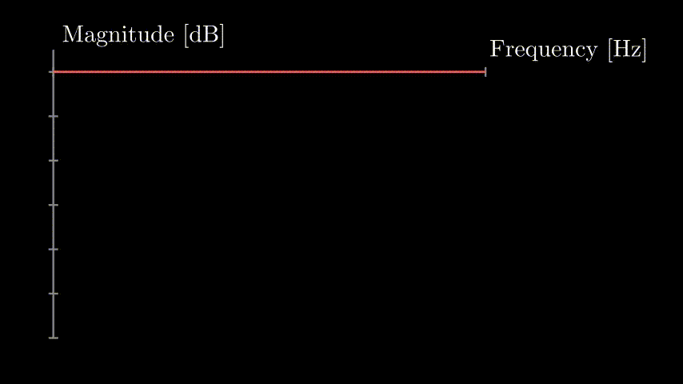

# DrumFixer

DrumFixer is an audio plugin designed to help mixing engineers
achieve better sounding drums. The basic idea is to damp 
frequencies in the drum sound that ring out too long.

## Usage

Place the DrumFixer plugin on a track that contains a single drum
sound. In our example, we will use the plugin on a snare drum 
track. Press the listen button, and then play a single drum
hit through the plugin. DrumFixer will record the drum sound,
and display the sound as a spectrogram.

Note which frequencies seem to ring out too long. Hover your mouse
over those frequencies on the spectrogram and click to choose a
frequency, bandwidth, and decay time. DrumFixer will then create a
filter that damps the drum sound at that frequency to achieve the
desired decay time.

Each time a filter is created, it is added to the filter list to
the left of the spectrogram. From this list, you can edit the filter
characteristics, or delete the filter.

## How it works

Each time you create a filter in DrumFixer, the plugin analyzes
the recorded drum sound by filtering out the frequencies of the
drum sound that the filter will be affecting. DrumFixer then
estimates the decay characteristic of the drum within that frequency
band, and determines the necessary amount of damping needed at that
frequency to achieve the desired decay time. Finally, every time a
new drum hit is detected passing through the plugin, the filter
dynamically adjusts the gain of the frequencies being processed
by the filter to apply the damping effect to the drum sound.

For a more in-depth explanation, feel free to checkout this
[`python` Notebook](https://ccrma.stanford.edu/~jatin/Notebooks/DrumFixer.html).

## Acknowledgements

The original idea for this plugin was developed by Mark Rau, and 
inspired by the GASP working group at [CCRMA](ccrma.stanford.edu).

## License

The code in this repository is licensed under the GPLv3.
The audio samples in the `Snares/` folder are licensed under
the Creative Commons License. For more information, see
[`Snares/_readme_and_license.txt`](Snares/_readme_and_license.txt).
